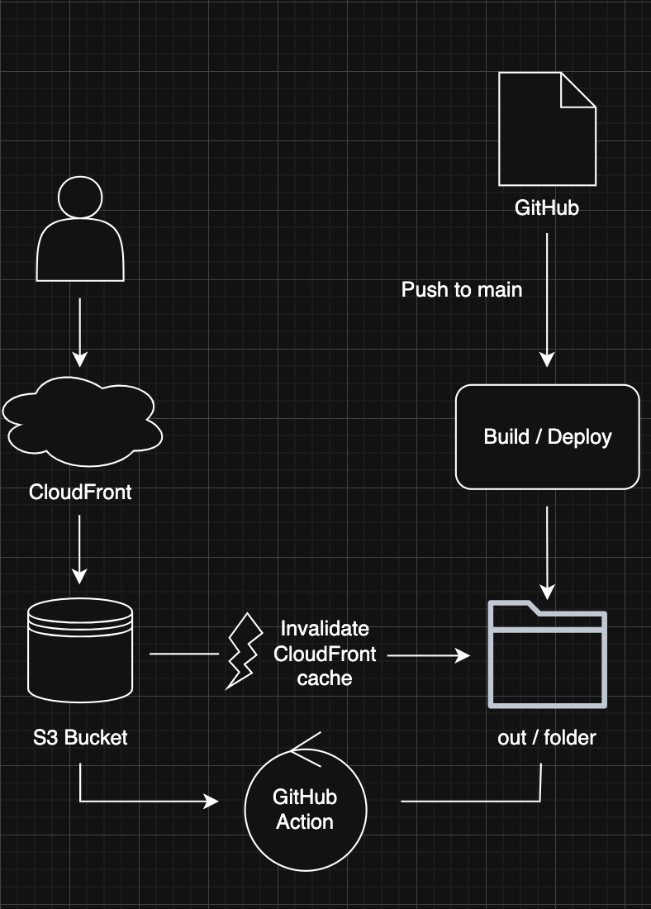

# 프론트엔드 배포 파이프라인

## 개요

GitHub Actions에 워크플로우를 작성해 다음과 같이 배포가 진행되도록 합니다.

(사전작업: Ubuntu 최신 버전 설치)

1. Checkout 액션을 사용해 코드 내려받기
2. `npm ci` 명령어로 프로젝트 의존성 설치
3. `npm run build` 명령어로 Next.js 프로젝트 빌드
4. AWS 자격 증명 구성
5. 빌드된 파일을 S3 버킷에 동기화
6. CloudFront 캐시 무효화

## 주요 링크

- S3 버킷 웹사이트 엔드포인트: [Link](http://lys-aws-bucket.s3-website-us-east-1.amazonaws.com)
- CloudFrount 배포 도메인 이름: [Link](https://d64uoxb59o11w.cloudfront.net)

## 주요 개념

주요 개념

- GitHub Actions과 CI/CD 도구:
  GitHub Actions는 코드 변경 시 자동으로 빌드, 테스트, 배포 등의 작업을 실행해주는 GitHub의 CI/CD 도구입니다.
  CI(지속적 통합)와 CD(지속적 배포)를 통해 개발자가 수동 개입 없이 안정적으로 코드를 운영 환경에 배포할 수 있게 도와줍니다.

- S3와 스토리지:
  S3(Simple Storage Service)는 AWS에서 제공하는 객체 스토리지 서비스로, 정적 웹사이트 파일(html, js, css 등)을 저장하고 호스팅할 수 있습니다.
  Next.js로 빌드된 정적 파일들은 out/ 디렉토리에 생성되며, 이 파일들을 S3에 업로드해 사용자에게 제공하게 됩니다.

- CloudFront와 CDN:
  CloudFront는 AWS의 글로벌 콘텐츠 전송 네트워크(CDN)로, S3에 저장된 정적 파일을 전 세계 엣지 로케이션을 통해 빠르게 전달합니다.
  사용자가 가까운 위치의 서버로부터 파일을 전달받기 때문에 로딩 속도 향상과 트래픽 분산에 효과적입니다.

- 캐시 무효화(Cache Invalidation):
  CloudFront는 파일을 캐시해두고 사용자에게 빠르게 제공하지만, 빌드 후 변경된 파일이 즉시 반영되지 않을 수 있습니다.
  이때 create-invalidation 명령을 통해 지정한 경로(예: /\*)에 대한 캐시를 무효화하여 최신 파일로 갱신할 수 있습니다.

- Repository secret과 환경변수:
  GitHub Actions 워크플로우에서는 AWS 자격 증명, 버킷 이름, CloudFront ID 등 민감한 정보를 직접 코드에 작성하지 않고
  Settings > Secrets and variables에 등록한 후 ${{ secrets.XXX }} 형태로 안전하게 불러와 사용할 수 있습니다.
